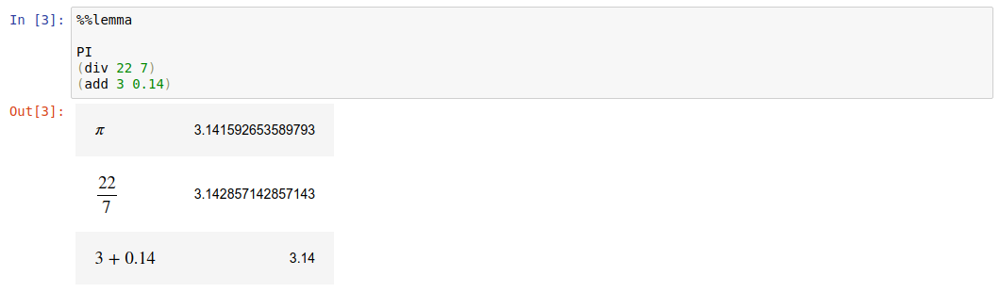

# Installation & Usage

You can install the latest version of Lemma in any Python environment
with Pip:

```
pip install lemma
```

Because Lemma is built on top of the [Hy
language](https://docs.hylang.org/) (a Lisp dialect embedded in
Python), Lemma code must be written in Hy modules in `.hy` files. If
you're not familiar with Hy, you can easily learn the basics from the
[Official Hy
Tutorial](https://docs.hylang.org/en/stable/tutorial.html) or (if
you're in a hurry) [Learn Hy in Y
Minutes](https://learnxinyminutes.com/docs/hy/). As an example, the
following Hy file defines a `mean` formula that computes the mean of
its arguments, and then tests the usage of that formula when the
module is executed as `__main__` (i.e. run from the command line):

``` scheme
;; myformulas.hy

(require [lemma.core :as le])
(import [lemma.domain.algebra [seq-sum div length]])

(le.def-formula mean r"\text{mean}"
  [&rest values]
  "Calculate the mean of the provided values."
  (seq-sum [x values]
           (div x (length values))))

(when (= __name__ "__main__")
  (print (.latex mean 1 2 3))
  (print (mean 1 2 3)))
```

Because Hy is automatically installed as a dependency of Lemma, you
can use `hy` to execute `.hy` files from the command line:

``` bash
$ hy myformulas.hy
\text{mean}\left(\{1, 2, 3\}\right) = \sum_{x \in \{1, 2, 3\}} x \div |\{1, 2, 3\}|
2.0
```

You can also import Hy modules from regular Python modules, allowing
you to use Lemma operators, expressions, constants, etc. in Python
code. To import Hy modules, you must first `import hy` in order for
Python to recognise `.hy` files:

``` python
# example.py

import hy # You must import `hy` before you can import other Hy modules
import myformulas # Assumes myformulas.hy exists next to example.py

print(myformulas.mean.latex(1, 2, 3))
print(myformulas.mean(1, 2, 3))
```

## Generating Documentation

Lemma provides the `lemmadoc` tool for generating automatic
[Markdown](https://daringfireball.net/projects/markdown/syntax)
documentation for Lemma operators, formulas, equations, constants, and
identifiers.

From the command-line, provide the name of any Hy module containing
Lemma definitions (if you have a file named `myformulas.hy` in the
same directory, the module's name is `myformulas`), and redirect the
output to a Markdown (`.md`) file you would like to save the
documentation in:

```bash
$ lemmadoc myformulas > myformulas-docs.md
```

## Writing Tests

Writing automated unit tests is a great way to ensure your Lemma
operators, formulas, equations, and expressions all function as you
intend them to.

While there are many great libraries for writing tests in Python,
[pytest](https://docs.pytest.org/) is a popular choice. `pytest` also
works particularly well with Lemma because you can easily configure it
to recognise tests in `.hy` files by including the following
`conftest.py` in your project's root directory:

``` python
# conftest.py

import hy
from _pytest.python import Module

def pytest_collect_file(path, parent):
    """Load .hy test modules."""
    if path.ext == ".hy" and (path.basename.startswith("test_") or path.basename.endswith("_test")):
        return Module.from_parent(parent, fspath=path)
```

After installing `pytest` and creating the `conftest.py` above, you
could write the following `test_myformulas.hy`, and execute it by
running `pytest` from the command-line:

``` scheme
(import myformulas)

(defn test-mean []
  (assert (= (myformulas.mean 1 2 3) 2.0)))
```

## Jupyter/IPython Notebooks

If you want to use Lemma from a Jupyter/IPython notebook, you can
install Lemma directly from a notebook cell using the `%pip` magic:

```
%pip install lemma
```

Lemma also provides a Jupyter/IPython extension that provides
automatic pretty-printing of LaTeX strings and useful "magics" for
writing Lemma code from your Python notebooks.

To load the Lemma extension, execute the following in a notebook cell:

```
%load_ext lemma.ipython
```

### `%%hy` cell magic

Beginning a cell with the `%%hy` magic will allow you to execute Hy
code:

``` scheme
%%hy

(require [lemma.core :as le])
(import [lemma.domain.algebra [PI div add]])

(le.expr (add 1 2))
```

### `%%lemma` cell magic

Beginning a cell with the `%%lemma` magic will allow you to write one
or more lemma forms, each of which will be interpreted as a Lemma
expression and rendered as LaTeX and the expression's resulting value
(but you must still import operators, constants, etc. in a separate
`%%hy` cell):



### `%hy` and `%lemma` line magics

You can also use `%hy` and `%lemma` to execute Hy code and Lemma
expressions inline within a Python code cell:

``` python
py_value = 3
print(py_value) # => 3

hy_value = %hy (le.expr (add 1 2))
print(hy_value()) # => 3

le_value = %lemma (add 1 2)
print(le_value()) # => 3
```

### Syntax Highlighting

If you would like lisp/scheme syntax-highlighting for your `%%hy` and
`%%lemma` cells, you can add the create the following
`~/.jupyter/custom/custom.js` file:

``` javascript
// ~/.jupyter/custom/custom.js

// Format %%hy and %%lemma cells using scheme syntax highlighting.
IPython.CodeCell.options_default.highlight_modes['magic_text/x-scheme'] = {'reg':[/^%%(hy|lemma)/]} ;
IPython.notebook.events.one('kernel_ready.Kernel', function(){
  IPython.notebook.get_cells().map(function(cell){
    if (cell.cell_type == 'code'){ cell.auto_highlight(); } }) ;
});
```
